# Kommunity Koin Workflow Diagrams

## System Architecture
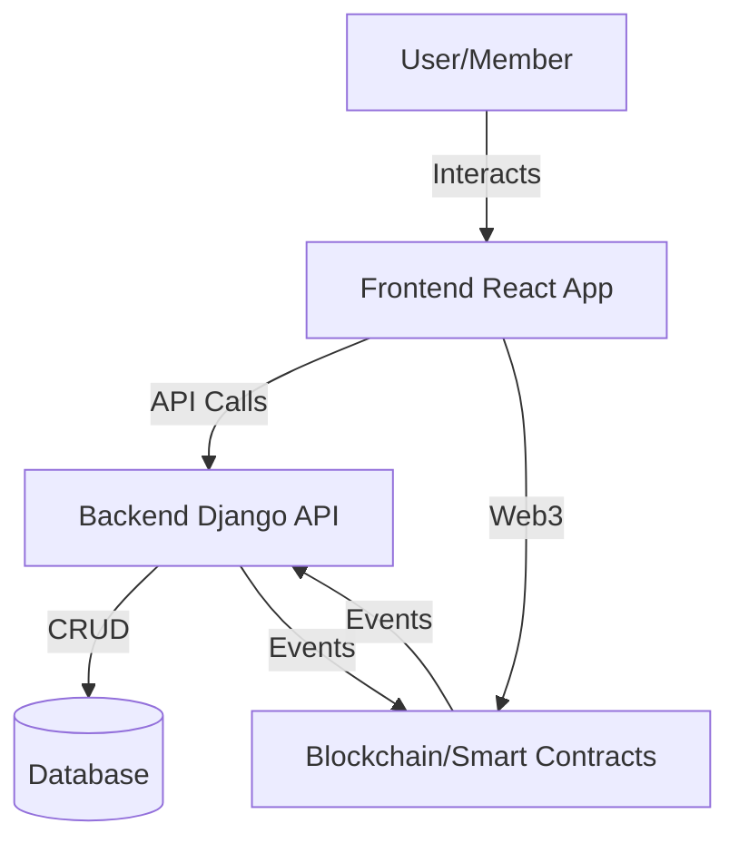

## User Registration and Community Join Flow
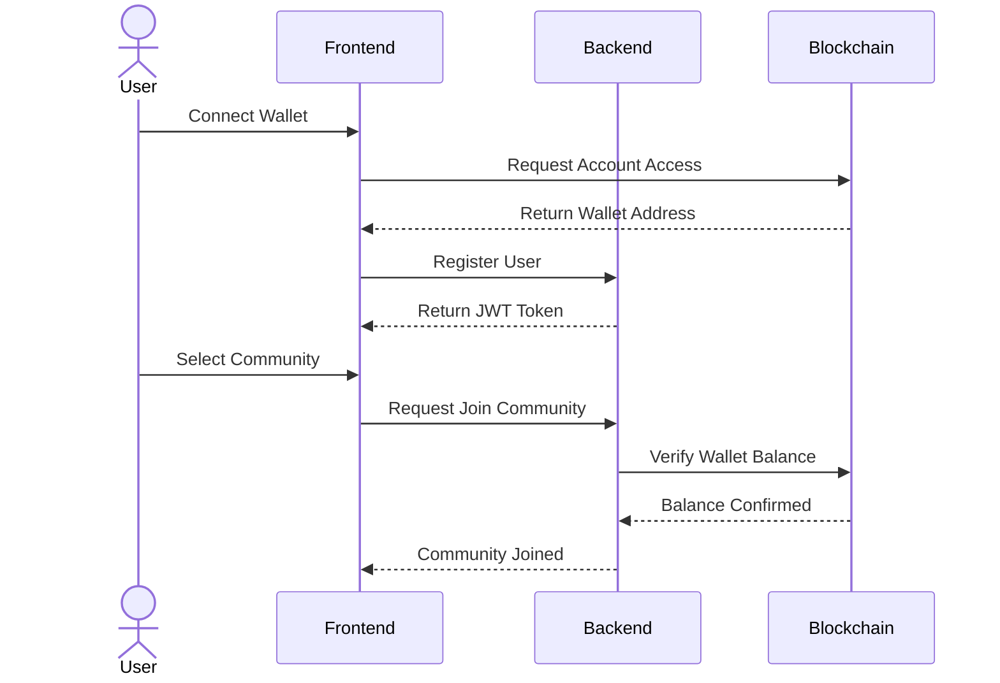

## Loan Creation and Approval Process
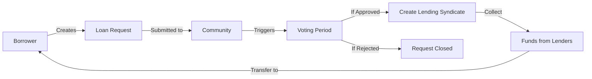

## Voting Process Flow
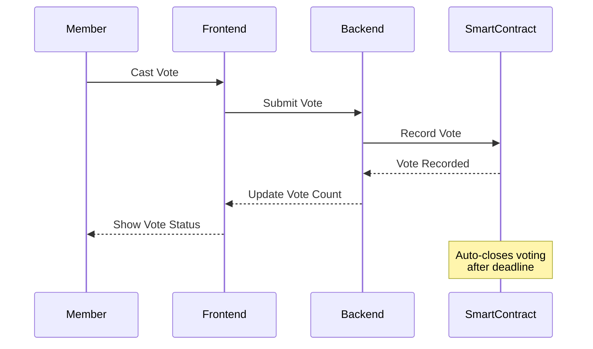

## Lending Syndicate Formation
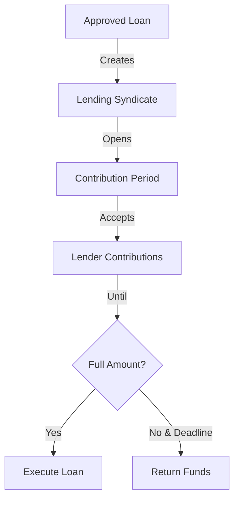

## Loan Repayment Process
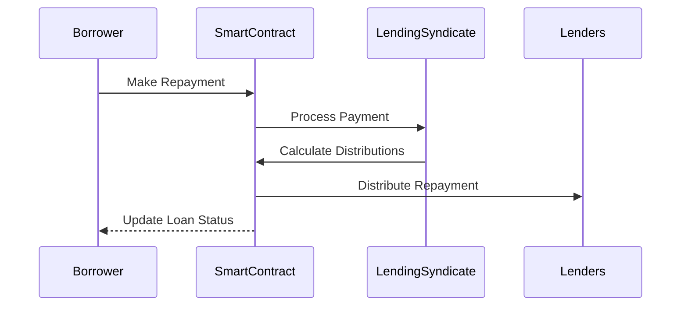

## Smart Contract Event Flow
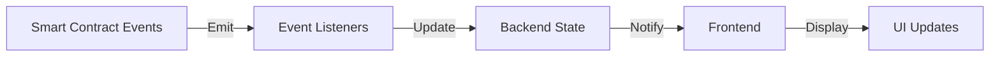

## Error Handling Flow
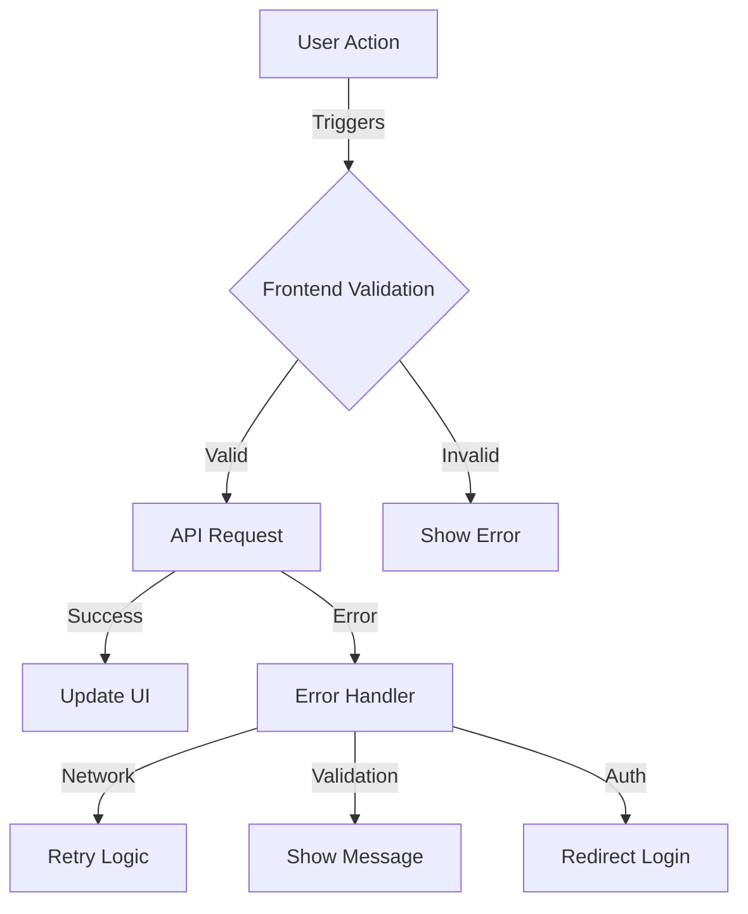

## Wallet Integration Flow
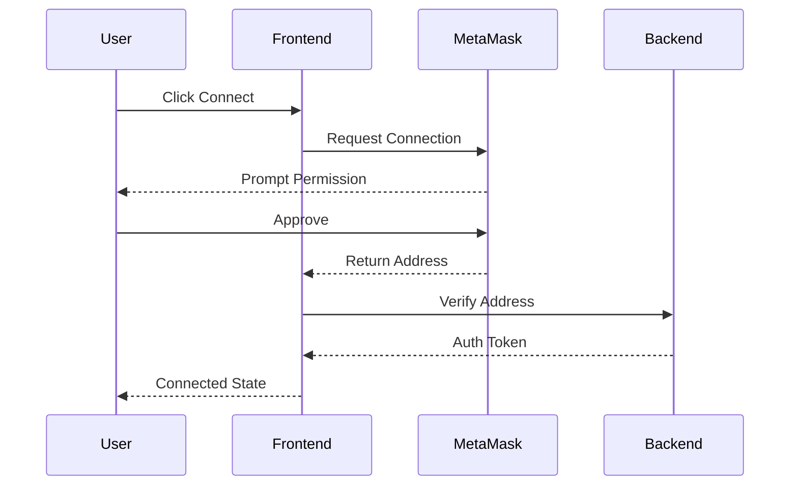

## Data Synchronization
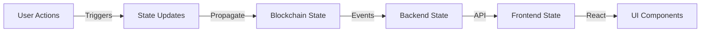

## Security Flow
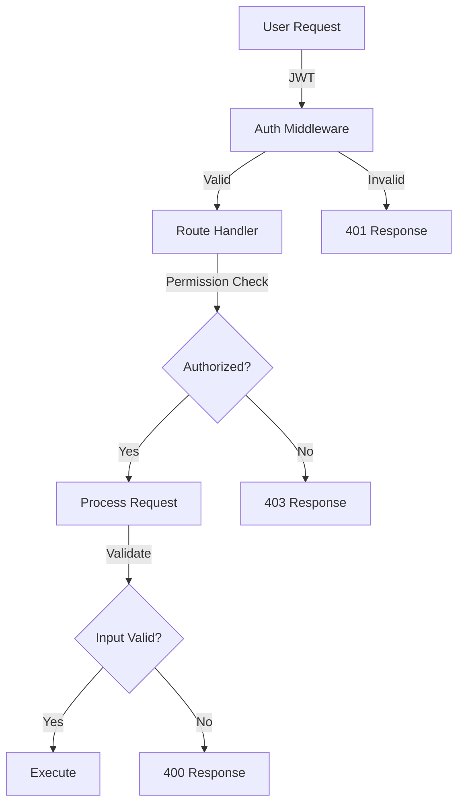

These diagrams provide a comprehensive view of:
1. System architecture and component interaction
2. User flows and processes
3. Loan lifecycle management
4. Security and authentication flows
5. Error handling and data validation
6. Blockchain integration
7. State management and data flow

The diagrams are in Mermaid format, which GitHub automatically renders in markdown files.